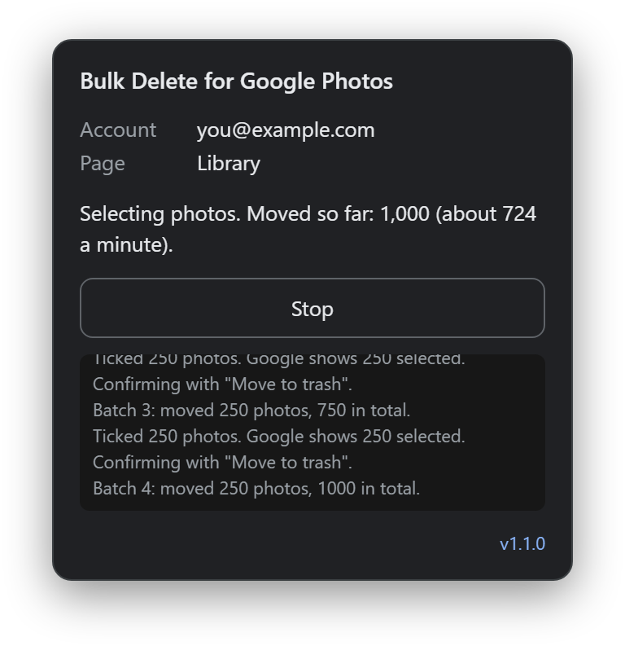

# Bulk Delete for Google Photos

**Move all the photos in your Google Photos library to the trash, about 750 a minute. Free, no daily limit, and nothing leaves your browser.**

[](https://github.com/JasonKrijgsman/bulk-delete-for-google-photos/releases/latest)
[](https://github.com/JasonKrijgsman/bulk-delete-for-google-photos/actions/workflows/ci.yml)
[](LICENSE)



Google Photos has no "select all" and no "delete all" button, so a mass delete means clicking thousands of checkboxes. Paid extensions sell a "delete all" button, and their free versions stop after a few hundred photos a day. This one is free and open source, and it keeps going until it is done. It ticks your photos for you and moves them to the trash in batches of up to 250. On a real account it moved 2,903 photos in four minutes.

Use it as an extension in Chrome, Edge, Brave and other Chromium browsers, or as a userscript in Firefox and other browsers. More on the [website](https://jasonkrijgsman.github.io/bulk-delete-for-google-photos/).

## Quick start

1. Download [bulk-delete-for-google-photos.zip](https://github.com/JasonKrijgsman/bulk-delete-for-google-photos/releases/latest/download/bulk-delete-for-google-photos.zip) and unzip it.
2. Open `chrome://extensions`, turn on **Developer mode**, click **Load unpacked** and pick the unzipped folder.
3. Open [photos.google.com](https://photos.google.com). In the panel at the bottom right, click **Move to trash**, then **Yes, move them**.

It only moves photos to the trash. You decide when to empty it.

## Install

### Chrome, Edge, Brave and other Chromium browsers

It is not in the Chrome Web Store, so you load it yourself:

1. Download [bulk-delete-for-google-photos.zip](https://github.com/JasonKrijgsman/bulk-delete-for-google-photos/releases/latest/download/bulk-delete-for-google-photos.zip) from the [latest release](https://github.com/JasonKrijgsman/bulk-delete-for-google-photos/releases/latest) and unzip it. Or clone this repository.
2. Open `chrome://extensions` (`edge://extensions` in Edge, `brave://extensions` in Brave).
3. Turn on **Developer mode**.
4. Click **Load unpacked** and pick the unzipped folder. In a clone, pick the `extension` folder.

Chrome puts its button in the extensions menu, behind the puzzle piece. Pin it there to keep it in the toolbar. On Google Photos the button shows the panel. Anywhere else it opens Google Photos in a new tab.

To update, unzip the new ZIP over the old folder. Then click the reload arrow on the extension's card in `chrome://extensions`. The [Releases page](https://github.com/JasonKrijgsman/bulk-delete-for-google-photos/releases) also has a ZIP with the version in its name, and a SHA-256 file for each ZIP.

### Firefox, or any browser with a userscript manager

1. Install a userscript manager, such as [Violentmonkey](https://violentmonkey.github.io/) or [Tampermonkey](https://www.tampermonkey.net/).
2. Click **[Install the userscript](https://github.com/JasonKrijgsman/bulk-delete-for-google-photos/releases/latest/download/bulk-delete-for-google-photos.user.js)**. The manager shows the script and offers to install it.
3. Open [photos.google.com](https://photos.google.com). The panel appears at the bottom right.

The userscript is `extension/remover.js` with a userscript header on top. It runs only on photos.google.com and asks the manager for no extra rights (`@grant none`). The manager can keep it up to date. Use the extension or the userscript, not both. The userscript is new in version 1.1.0; if it does not start in your browser, [report a bug](https://github.com/JasonKrijgsman/bulk-delete-for-google-photos/issues/new?template=bug_report.yml).

In Chrome, Edge and Brave, a userscript manager also needs **Allow User Scripts** turned on in its extension details (Chrome 138 and later; older versions use Developer mode).

### Without installing

You can also paste `extension/remover.js` into the browser console on photos.google.com (press F12, then open Console). Chrome asks you to type `allow pasting` first. Read the script before you paste it. Never paste code you do not trust into a console.

## How to use

1. Open [photos.google.com](https://photos.google.com) and sign in to the account you want to clean up.
2. Close any Google pop-up, such as a storage warning.
3. Find the panel at the bottom right. If you hid it, click **Bulk Delete** there, or click the extension's button in the toolbar.
4. Check the account in the panel. The photos come from that account.
5. Enter how many photos to move, or leave the box empty to move all of them.
6. Click **Move to trash**, then **Yes, move them**.
7. Keep the tab open and in front until the panel says it is done. It pauses while the tab is hidden, because Chrome hardly draws a hidden tab.
8. To delete the photos for good, open the trash in Google Photos and empty it yourself.

While it runs, the panel shows how many photos it moved and how fast. The tab title shows the count too. At the end, the panel shows the total and the time it took.

It moves about 750 photos a minute. Its first real run emptied a Library of 2,903 photos in four minutes, then an Archive of 86.

**Stop** ends the run safely. Before a batch reaches the trash button, it clears the selection. Once Google is moving a batch, it lets that batch finish and counts it.

Google's confirm dialog says the photos will be removed from your Google account, your backed-up devices and the places you shared them. That is how Google words a move to the trash. The photos go to the trash, and Google says so at the bottom of the page.

To clean up archived photos, open **Archive** first and do the same.

## What it does

- It ticks the photos in your Library or Archive, from the top down, the same way you would.
- It clicks the Google Photos trash button and confirms, in batches of up to 250 photos.
- It stops at the number you set, or when nothing is left.

## What it never does

- It never empties the trash. Your photos stay in the trash for 30 days, and you can restore them from there. Google cut this from 60 days in September 2026; see [Google's help](https://support.google.com/photos/answer/6128858).
- It clicks nothing unless the page is your Library or your Archive. It stops when the page or the signed-in account changes.
- It never clicks a button, and never confirms a dialog, that speaks of emptying the trash or deleting for good. It recognises those words in about 30 languages.
- It sends nothing anywhere and makes no network requests. It only runs on photos.google.com; Chrome lists that site as the one it can read and change.

## Compared with paid extensions

Paid extensions sell a "delete all" button, and their free versions stop after a few hundred photos a day. This one is different:

- **Free.** No paid version, no trial and no licence key.
- **No daily limit.** It keeps going until your Library is empty.
- **Open source.** MIT licence. All the work happens in one file that you can read before you use it.
- **No account.** There is nothing to sign up for.
- **No tracking.** No analytics and no network requests. Nothing leaves your browser.

## FAQ

### Can I delete all my Google Photos at once?

Yes. Leave the number box empty, and it moves every photo in your Library to the trash, up to 250 at a time, until nothing is left. Then open **Archive** and do the same there. To delete the photos for good, empty the trash in Google Photos.

### Is it permanent?

No. It only moves photos to the trash, and it never empties the trash. Google keeps them there for 30 days, and you can restore them until then. Google deletes them for good after 30 days, or when you empty the trash yourself.

### Will it delete the photos from my phone too?

It can. When you delete a photo in Google Photos, Google also removes it from the Android phones, iPhones and iPads that have Google Photos installed with backup turned on for that account. See [Google's help](https://support.google.com/photos/answer/6128858). The confirm dialog of Google Photos warns about this too. To keep copies, download your photos first with [Google Takeout](https://takeout.google.com/).

### Does it upload anything or track me?

No. It makes no network requests and has no analytics. It only clicks buttons on photos.google.com, in your own browser, the same buttons you would click. The extension asks for no permissions: Chrome lists photos.google.com as the one site it can read and change. The tests check the code for network calls.

### Is it really free?

Yes. There is no paid version and no daily limit. It is open source under the MIT licence.

### Which languages does it work in?

It was tested live on the Dutch interface of Google Photos. It knows the word for "trash" in more than 30 languages. If it cannot find a button in your language, it asks you to click that button once. See [Languages](#languages).

### Why does Google Photos have no "delete all" button?

Google has not added one. On the web you can tick a whole day, or tick one photo and Shift-click another to select everything between them. With thousands of photos, that still means a lot of scrolling and clicking. This tool does the ticking for you, in batches of up to 250, and checks Google's count before each batch.

### How do I free up Google storage?

Google Photos, Gmail and Google Drive share your Google storage. To free the space your photos take:

1. Move them to the trash with this tool, in your Library and in your Archive.
2. Empty the trash in Google Photos. That deletes them for good. Otherwise Google does it after 30 days.
3. Check your storage at [one.google.com/storage](https://one.google.com/storage). Google says that when you delete many photos at once, it can take some time before the space is freed.

## Languages

It was tested on the Dutch interface of Google Photos.

- It finds the trash button by its label. It knows the word for "trash" in more than 30 languages.
- It finds the confirm button by a code Google puts on the buttons of its dialogs. On the Dutch interface that code is not text, so it is likely the same in other languages; that has not been checked.
- If it cannot find a button in your language, it asks you to click that button once. It remembers your click after the first batch works. **Forget learned buttons** in the panel clears what it learned.

If it does not work in your language, [report a bug](https://github.com/JasonKrijgsman/bulk-delete-for-google-photos/issues/new?template=bug_report.yml) and name your interface language.

## Troubleshooting

| Message or problem | What to do |
|---|---|
| The panel does not appear | Reload the page. If you hid the panel, click **Bulk Delete** at the bottom right. Check that the extension is turned on in `chrome://extensions`. For the userscript, check that the manager and the script are turned on, and see the note on **Allow User Scripts** under [Install](#firefox-or-any-browser-with-a-userscript-manager). |
| Open your Photos library or your Archive first | It only works on those two pages. Go to [photos.google.com](https://photos.google.com) for the Library, or [photos.google.com/archive](https://photos.google.com/archive) for the Archive. |
| Could not see which Google account is signed in | Reload the page, then start again. |
| Close the Google Photos pop-up first | Close the pop-up, then start again. |
| Paused while this tab is hidden | Bring the tab back to the front. It goes on by itself. |
| It asks you to click the trash button, or the button in the Google dialog | It does not know that button in your language yet. Click it once. It remembers the button after the first batch works. |
| Could not read how many photos Google selected | Nothing from that batch was moved. Check that no photos are still selected. Open an issue and name your interface language. |
| Google selected more photos than planned | Nothing from that batch was moved. Start again. |
| The page or the account changed | It stopped on purpose. Go back to the Library or Archive and start again. |
| More than one Google dialog opened | Nothing was confirmed. Close the dialogs, then start again. |
| The Google dialog speaks of emptying the trash or deleting for good | Nothing was confirmed, on purpose: this tool never deletes for good. Read Google's dialog yourself. Then open an issue and name your interface language. |
| Google did not remove all photos from the last batch | Google may be slowing you down. Wait a while, then start again. |
| Any other message | Reload the page and start again. If it happens again, report a bug. |

Google changes its pages from time to time. If it stops working, [report a bug](https://github.com/JasonKrijgsman/bulk-delete-for-google-photos/issues/new?template=bug_report.yml).

## Report a problem

[Open a bug report](https://github.com/JasonKrijgsman/bulk-delete-for-google-photos/issues/new?template=bug_report.yml). The form asks for:

- your browser and its version,
- how you installed it: the extension or the userscript,
- the language of your Google Photos interface,
- what the panel said, and the log lines from the grey box in the panel.

**Leave out your email address.** The panel shows your account, and the first log line names it.

Ideas are welcome too: [suggest a feature](https://github.com/JasonKrijgsman/bulk-delete-for-google-photos/issues/new?template=feature_request.yml).

## How it works

`extension/remover.js` does all the work. It has three parts:

- **The runner** holds the procedure: select a batch, check the count Google shows, click the trash button, confirm, then check that the photos are gone.
- **The page adapter** finds things by the structure of the page, not by the class names Google generates. A photo checkbox is a checkbox that sits next to exactly one link to a photo. Every click on a Google Photos element goes through one function, which refuses off the Library and the Archive.
- **The panel** is the small window at the bottom right.

`extension/background.js` only runs the toolbar button. On a Google Photos tab it asks the panel to show itself. Anywhere else it opens Google Photos in a new tab. It needs no permissions for that.

The userscript is the same `remover.js` with a userscript header on top.

It checks its own work:

- It only clicks on the page and in the account you confirmed. If either changes, it stops.
- Before each batch it reads the count Google shows. If it cannot read the count, or the count is higher than planned, it clears the selection and stops.
- It only confirms a dialog that stays the only new one for 1.5 seconds, and that has both Google's confirm and cancel codes.
- After confirming, the selection must disappear. Then photos must show at the top of the grid again, and none of them may be from that batch.
- It never clicks the select-all box of a day, because one click there can select hundreds of photos.

## Development

The extension has no build step. The `extension` folder is the product.

```
npm test
```

This runs the unit tests and, when Chrome is installed, a headless run against `test/fixture/photos.html`. That page copies the structure of the Google Photos library page. Its scenarios include a decoy trash button outside the top bar, a right-to-left layout, an "Empty trash" button, dialogs that would empty the trash or delete for good, a pop-up next to the confirm dialog and a number badge in the top bar. Set `CHROME_PATH` when Chrome is not found.

The userscript in `userscript/` is built from `extension/remover.js` and the version in the manifest. After you change either, build it again and commit it:

```
npm run build:userscript
```

A test fails when the committed userscript is out of date.

To draw the icons again: `python scripts/make-icons.py`.

To publish a release, follow the steps in [AGENTS.md](AGENTS.md#release).

## Website

[jasonkrijgsman.github.io/bulk-delete-for-google-photos](https://jasonkrijgsman.github.io/bulk-delete-for-google-photos/)

## Not affiliated with Google

Google Photos is a trademark of Google LLC. This project is not affiliated with, sponsored by or endorsed by Google.

## Licence

[MIT](LICENSE)
